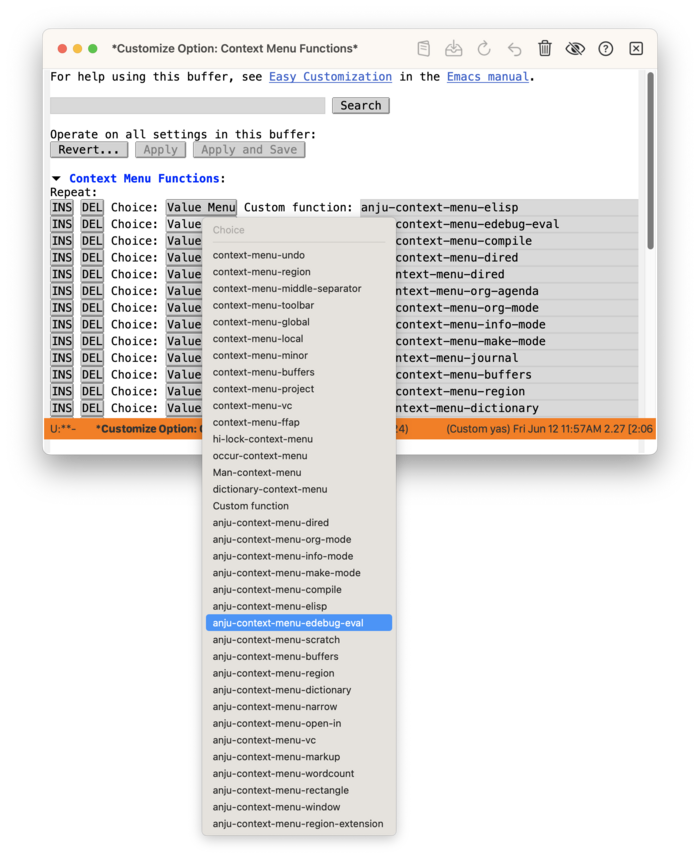

#+startup: overview nologdone
#+startup: showeverything
#+TITLE: Anju User Guide
#+SUBTITLE: for version {{{version}}}
#+AUTHOR: Charles Y. Choi
#+EMAIL: kickingvegas@gmail.com
#+OPTIONS: ':t toc:t author:t email:t H:4 f:t
#+LANGUAGE: en
#+MACRO: version 1.5.3-rc.1
#+MACRO: kbd (eval (org-texinfo-kbd-macro $1))
#+TEXINFO_FILENAME: anju.info
#+TEXINFO_CLASS: casual
#+TEXINFO_HEADER: @syncodeindex pg cp
#+TEXINFO_HEADER: @paragraphindent none
#+TEXINFO_TITLEPAGE: t
#+TEXINFO_DIR_CATEGORY: Emacs misc features
#+TEXINFO_DIR_NAME: Anju
#+TEXINFO_DIR_DESC: A package for customizing Emacs mouse interactions.
#+TEXINFO_PRINTED_TITLE: Anju User Guide

Version: {{{version}}}

#+TEXINFO: Copyright © 2026 @w{Charles Y. Choi}

Anju (안주) is a project to align mouse interactions in Emacs with contemporary (circa 2026) expectations. Effort towards this alignment is made in the following areas:

- Context-sensitive menus
- De-emphasis of middle mouse button usage (binding =<mouse-2>=)
- Support direct manipulation when possible
- Re-organization of the menu bar

The features offered by Anju are opinionated, but avoids unconventional behavior. Anju aspires to bring a calmer mouse experience to Emacs.

Please note that all UI terminology in this document is Emacs-centric and differs from conventional GUI terminology. Refer to (emacs) Frames ([[info:emacs#Frames][emacs#Frames]]) for more detail on this.

#+INCLUDE: "./sponsorship.org"

* Copying
:PROPERTIES:
:COPYING: t
:END:

Copyright © 2026 Charles Y. Choi

* Motivation
#+CINDEX: Motivation

The Anju package is intended to change the default mouse interactions in Emacs for the following reasons:

- Uneven implementation of context-sensitive menus for different modes.
- Over-commitment to legacy usage of the middle mouse button.
- Lengthy menus that feel more like an inventory of commands rather than a designed user experience.
- Over-reliance on mouse workflows that require switching between the mouse and keyboard.

Anju makes opinionated design decisions, but avoids unconventional behavior. Anju aspires to bring a calmer mouse experience to Emacs.

Elaboration on what informs Anju's opinions is described below.

** Design Principles and Concerns
:PROPERTIES:
:CUSTOM_ID: design-principles
:END:

#+CINDEX: Design Principles and Concerns

This section conveys the principles and concerns used by Anju to inform its design decisions.

Editorially, all design decisions for Anju are ultimately the opinion of Charles Y. Choi.

#+TEXINFO: @subheading General Principles

- Menus should be organized.
  - A coherent information architecture should be conveyed.
  - Balance between concision and discoverability should be made in a menu's offerings.
- Nesting of sub-menus should be carefully considered, ideally not exceeding a depth of two.
- Mouse workflows that require keyboard input should be minimized.
- If the opportunity to provide a direct manipulation experience is available, it should be taken.
- Unconventional mouse interactions should be avoided.

#+TEXINFO: @subheading Concerns

Anju takes the position that different types of menus have different concerns or objectives. This is most apparent in contrasting the design of a main menu section (e.g. File, Edit, Options, …) to that of a context menu.

For Anju:

- The highest concern of a main menu section is discoverability.
- The highest concern of a context menu is concision.

A common implementation practice in Emacs is to reuse menu keymaps for both the main menu and context menus. This violates the above concerns, which Anju seeks to address.

The next sub-sections further detail the design concerns with respect to an area where mouse interaction occurs.

#+TEXINFO: @subsubheading Context Menu

A context menu (as its name implies) should constrain itself to commands relevant to /context/. The parameters of this context are usually (although not exclusively) defined by a subset of:

- Point (cursor) position
- Text selection
- Mouse cursor position
- Major mode
- Read-only state (on or off)

Anju takes the opinion that context menus should /not/ support general command discovery. The context menu offering should be /concise/. Users seeking command discovery should instead look at the main menu.

#+TEXINFO: @subsubheading Direct Manipulation

Support for direct action based on mouse cursor position is a common user interaction technique. Anju applies this to Emacs window management, where window creation, deletion, and swapping are supported from both the context menu and the mode line.

#+TEXINFO: @subsubheading No Middle Button Bindings

Anju eschews Emacs' default middle mouse button bindings as they presume usage of a [[https://upload.wikimedia.org/wikipedia/commons/thumb/e/ea/Sun_optical_mouse.jpg/960px-Sun_optical_mouse.jpg][90's style 3-button mouse]]. This style of mouse design has long been superseded with a middle [[https://upload.wikimedia.org/wikipedia/commons/2/22/3-Tasten-Maus_Microsoft.jpg][scroll-wheel+button control]]. This widespread hardware change has resulted in the majority of mouse-supporting applications to emphasize scrolling actions with the middle control and clicking actions to the left and right buttons. Anju follows suit, primarily binding the right mouse button click (down) event to raising a context menu. In addition, Anju reconfigures commands that were previously bound to the middle button to ones accessible via a context menu.

The only exception Anju makes in this matter is to keep the Emacs default binding of ~mouse-2~ to ~mouse-yank-primary~.

* Features
#+CINDEX: Features

Anju offers many enhancements to the mouse interactions provided by Emacs. These enhancements are detailed in the following sections below.

** Mode Line Features
:PROPERTIES:
:CUSTOM_ID: mode-line
:END:
#+CINDEX: Mode Line Features

The following mode line enhancements are provided by Anju:

#+TEXINFO: @subheading Pop-up Buffer List
#+CINDEX: Pop-up Buffer List

On the mode line, left-click (~mouse-1~) on the buffer name to raise a pop-up menu containing a list of open buffers. The contents of this list is controlled by the customizable variable ~anju-buffer-list-filter-functions~. More info on customizing the buffer list menu can be found in [[#mode-line-menu-customization][Mode Line Buffer List Menu Customization]].

[[file:images/anju-mode-line-buffer-list.png]]

#+TEXINFO: @subheading Window Management
#+CINDEX: Window Management

A right-click (~mouse-3~) on any blank space on the mode line will pop-up a window management menu.

[[file:images/anju-mode-line-window-management.png]]

From here, one can:
- Delete the window (×)
- Split the window horizontally (→)
- Split the window vertically (↓)
- If multiple windows are shown, swap the current window.

Note: usage of "window" refers to the Emacs definition of it. Refer to [[info:emacs#Frames]] for more detail on this.

#+TEXINFO: @subheading Toggle Maximize Window
#+CINDEX: Toggle Maximize Window

A left-double-click on any blank space on the mode line will checkpoint the current window configuration, then maximize the current window (~delete-other-windows~). Re-doing the left-double-click will restore the prior window configuration.

** Context Menu Features
:PROPERTIES:
:CUSTOM_ID: context-menu
:END:
#+CINDEX: Context Menu Features

Anju enhances ~context-menu-mode~ by providing context menu functions to support the following contexts:

- Selected text
- Mode-specific commands
  - Org mode
  - Dired
  - Emacs Lisp
  - Compilation/Grep
  - Info
  - Makefile
- Rectangles
- Version-controlled source
- Window management
- Full support for ~context-menu-mode~ customization (See [[#context-menu-customization][Context Menu Customization]]).

Anju deliberately omits the display of the default mode-specific menu keymaps in the context menu as they are considered redundant to their display in the main menu. Rationale for this is described in [[#design-principles][Design Principles and Concerns]]. Users can still access the default mode-specific menu keymap by using the binding {{{kbd(C-<mouse-3>)}}}.

Learn more about the different areas Anju enhances context menus in the links below.

*** Selected Text Commands
#+CINDEX: Selected Text Commands

[[file:images/anju-context-menu-region.png]]

If a context menu is raised on selected text, the following menu items are displayed:

- Occur :: Run ~occur~ command to show occurrences of selected text.

- Style :: Applies mode-specific markup to emphasize the selected text (e.g. bold, italic, code, etc.).
  - Available only for ~org-mode~ and ~markdown-mode~.

- Transform Text :: Applies transforms (upper/lower case, capitalize) to the selected text.

- Query Replace :: Run ~query-replace~ on selected text.

- Query Replace Regexp… :: Run ~query-replace-regexp~ on selected text.

- Toggle comment  :: Toggles selected text to be commented based on mode.
  - Available only on modes derived from ~prog-mode~ and ~org-mode~

- Write Region… :: Writes selected text to a user-specified file.

- Look Up :: If a word is selected, uses ~dictionary~ to look up its definition.

- Copy as… :: If the current buffer is using Org mode, then this sub-menu is displayed. Learn more about this in [[#org-copy-as-context-menu][Org “Copy as…” Context Menu]].

*** Org Mode Context Menu
#+CINDEX: Org Mode Context Menu

Anju provides context-sensitive support for Org mode by providing commands relevant to the type of Org element the point is in. Org elements supported by Anju are:

- Headline
- Item
- Table

In addition if text is selected, then support for styling, linking, and copying as a different format are supported.

Note that the Org mode context menu is deliberately restrained in its command offering in accord with Anju's [[#design-principles][Design Principles and Concerns]].

It is recommended that the ~org-mouse~ package be loaded when using Anju.

**** Org Headline Context Menu
#+CINDEX: Org Headline Context Menu

If the context menu is raised on a headline, then commands related to TODO state, change to body, clocking, sorting, and promotion are offered.

[[file:images/anju-context-menu-org-headline.png]]

**** Org Item Context Menu
#+CINDEX: Org Item Context Menu

If the context menu is raised on a list item, then commands related to sorting, cycling bullet-style, promotion and checkbox operations are provided.

The menu item "Change to Checkbox" will convert an item to a checkbox, with the additional behavior that if the point is at the start of the whole list, the whole list will be converted.

[[file:images/anju-context-menu-org-item.png]]

A checkbox can be converted back to a list item using “Change to Item” as shown below. If ~org-mouse~ is loaded then the checkbox state can be toggled between on ('[X]') or off ('[ ]'). Anju provides the “In-Progress [-]” menu item to put the checkbox in an intermediate state.

[[file:images/anju-context-menu-org-item-inprogress.png]]

Note that checkboxes in screenshots are prettified using ~prettify-symbols-mode~.

**** Org Table Context Menu
#+CINDEX: Org Table Context Menu

If the context menu is raised in a table, then table-specific commands are shown.

[[file:images/anju-context-menu-org-table.png]]

The context menu shows the current Org table cell reference where the point is in (e.g. ~@3$2~). Clicking on this reference will copy it to the ~kill-ring~ for subsequent use in a table formula.

If a selected region or rectangle is made whose extents are within the table, then the table region reference  is displayed.

The “Org Table Region” sub-menu provides commands to cut, copy, and paste rectangular regions made in the table. Note that the binding {{{kbd(C-M-<mouse-1>)}}} lets you make rectangle selections.

**** Org Insert Link
#+CINDEX: Org Insert Link

[[file:images/anju-context-menu-org-link.png]]

If the point is on selected text or an existing Org link, the context menu will have the menu item “Link…” to run the command ~org-insert-link~. From there you can add or edit a link.

If an Org link has already been stored, then the menu item “Paste Last Org Link” will be displayed. See more at [[#org-paste-context-menu][Org Paste Context Menu]].

**** Org Toggle Images & Show Markup
#+CINDEX: Org Toggle Images & Show Markup

[[file:images/anju-context-menu-toggle-images-markup.png]]

The Org context menu supports the following menu items except for when the point is in a table:

- Toggle Images :: Toggle display of images when running in GUI.

- Show Markup :: Reveal or hide display of Org markup.

**** Org “Copy as…” Context Menu
:PROPERTIES:
:CUSTOM_ID: org-copy-as-context-menu
:END:
#+CINDEX: Org Copy as Context Menu

[[file:images/anju-context-menu-org-copy-as.png]]

If text is selected, the “Copy as…” sub-menu will be presented. This sub-menu will provide different format options to export the selected text to the system clipboard for subsequent pasting. The following formats are supported.

- GFM  (GitHub Flavored Markdown, only available if the ~ox-gfm~ ([[https://melpa.org/#/ox-gfm][MELPA]]) package is installed)
- Markdown
- LaTeX
- HTML
- ASCII
- Slack (only available if the ~ox-slack~ ([[https://melpa.org/#/ox-slack][MELPA]]) package is installed)
- RTF (only available on macOS)

Users who frequently work with other text-based formats may find this menu useful.

Markdown users may find the companion feature of “Paste Markdown as Org” also useful ([[#org-paste-context-menu][Org Paste Context Menu]]).

**** Org Paste Context Menu
:PROPERTIES:
:CUSTOM_ID: org-paste-context-menu
:END:
#+CINDEX: Org Paste Context Menu

[[file:images/anju-context-menu-enhanced-paste.png]]

Anju adds more “Paste” commands that will display given the right context.

- Paste Last Org Link :: If it exists, this command will insert the last stored Org link.

- Paste Markdown as Org :: If the clipboard (latest yank) is known by the user to be Markdown text, this command will convert the clipboard text to Org via ~pandoc~, then paste (yank) it into the buffer.

- Paste Media :: If an image as been copied into the clipboard, this menu item will "paste" it via the ~yank-media~ command.

*** Dired Mode Context Menu
#+CINDEX: Dired Mode Context Menu

Anju enhances the context menu support for Dired mode. The screenshot below shows the context menu when the mouse point is over a file.

[[file:images/anju-context-menu-dired-copy-to.png]]

If the mouse point is over a directory, the option to insert a view (aka subdir) for it in the buffer is provided.

[[file:images/anju-context-menu-dired-insert-subdir.png]]

Note that the Dired context menu is intentionally restrained in its command offering in accord with Anju's [[#design-principles][Design Principles and Concerns]].

*** Info Context Menu
#+CINDEX: Info Context Menu

Anju enhances the context menu support for Info mode. Notable additions include copying the node name to the ~kill-ring~ and opening the node in a web browser.

[[file:images/anju-context-menu-info.png]]

*** Emacs Lisp Context Menu
#+CINDEX: Emacs Lisp Context Menu

Anju enhances the context menu for Emacs Lisp (Elisp) development with support for Edebug and ERT.

**** Basic Elisp Context Menu
#+CINDEX: Basic Elisp Context Menu

Anju enhances the default Elisp context menu by providing commands for evaluating, debugging, and refactoring Elisp. Many of these commands are context-sensitive to point location. If a command does not apply at point, it will not be shown in the context menu.

If hideshow ([[info:emacs#Hideshow]]) support is enabled, then a sub-menu “Hide/Show” is provided.

The screenshot below shows the context menu raised when the point is on the function ~foo~. Selecting the menu item “Edebug “foo”” will instrument ~foo~ for debugging. On the next invocation of ~foo~, the Edebug debugger will be run. Anju enhances the [[#edebug-mode-context-menu][context menu for Edebug]] as well.

[[file:images/anju-context-menu-elisp.png]]

Note that the Emacs default context menu for Elisp supports Xref ([[info:emacs#Xref]]) navigation as well as help (~describe-function~) and Info lookup as shown below.

[[file:images/anju-context-menu-elisp-built-in.png]]

**** Edebug Mode Context Menu
:PROPERTIES:
:CUSTOM_ID: edebug-mode-context-menu
:END:
#+CINDEX: Edebug Mode Context Menu

When debugging Elisp using Edebug, the following context menu offering its many commands is shown.

[[file:images/anju-context-menu-edebug.png]]

For users new to Edebug, it is helpful to understand that code execution is sexp-based as opposed to line/function-based in other IDEs.

To better understand Edebug's command set, a close reading of its manual is recommended ([[info:elisp#Edebug]]).

**** ERT Support
#+CINDEX: ERT Support

ERT is a built-in package for Emacs that supports automated testing of Elisp ([[info:ert#Top]]). Anju provides a convenience command to run an ~ert-deftest~ if the point is within its declaration. The screenshot below shows and example of running the ERT test ~test-foo~.

[[file:images/anju-context-menu-ert.png]]

The result of running ~test-foo~ is shown below.

[[file:images/anju-context-menu-ert-result.png]]

**** Extract Lambda (𝜆) Expression
#+CINDEX: Extract Lambda (𝜆) Expression

Anju provides support for extracting a lambda (𝜆) expression into a function declaration with the menu item “Extract 𝜆…”. This feature requires that the point be on the ~lambda~ symbol. The screenshots below shows this command in operation.

[[file:images/anju-context-menu-extract-lambda-1.png]]

The user will be prompted in the mini-buffer for a name of the new function. The example below shows ~add-two~.

[[file:images/anju-context-menu-extract-lambda-2.png]]

The result is that a temporary buffer named ~*add-two*~ (the input name is used) holding the new function is created and a reference to the new function (~#'add-two~) is substituted in-place at the original location of the lambda expression.

[[file:images/anju-context-menu-extract-lambda-3.png]]

The ~*add-two*~ buffer can be edited as needed and its contents placed into a desired Elisp file.

*** Compilation/Grep Context Menu
#+CINDEX: Compilation/Grep Context Menu

[[file:images/anju-context-menu-compilation.png]]

If the buffer is the output of a compilation, then its context menu is populated with commands to either recompile or invoke a new compile command.

If the buffer is the output of a Grep search, then its context menu is populated with the command to refresh the search.

*** Makefile Context Menu
#+CINDEX: Makefile Context Menu

[[file:images/anju-context-menu-makefile.png]]

This context menu offers commands provided by Makefile mode.

*** Rectangle Context Menu
#+CINDEX: Rectangle Context Menu

[[file:images/anju-context-menu-rectangle.png]]

If a rectangle selection is made ({{{kbd(C-M-<mouse-1>)}}}) or has been killed, then the “Rectangle” sub-menu is presented in the context menu. Anju treats a rectangle selection with the highest priority; most Anju context menus will /not/ display if a rectangle selection is made.

To learn more about rectangle commands, see [[info:emacs#Rectangles][info "(emacs) Rectangles"]].

*** Version-Controlled Source
#+CINDEX: Version-Controlled Source
#+CINDEX: Magit

[[file:images/anju-context-menu-vc.png]]

If a context menu is raised on a buffer containing a modified version controlled file, then support for viewing the difference between the modifications with its previous commit is provided by the menu item “Ediff revision…”.

If Magit 4.4+ is installed, then different Magit commands depending on context are displayed. If the context menu is raised in a file buffer, then the menu item "Magit Dispatch…" (~magit-file-dispatch~) is shown, otherwise "Magit Status" (~magit-status~).

** Main Menu Features
#+CINDEX: Main Menu Features

Anju enhances the menu bar of Emacs by making opinionated changes to its existing menus as well as adding several new ones. These changes are configurable per menu in the main menu (e.g. "File", "Edit", "Options", etc.). For more detail, see [[#main-menu-customization][Main Menu Customization]].

*** File Menu Features
#+CINDEX: File Menu Features

Anju makes the following modifications to the menu bar *File* menu:

- Adds a “Swap Window ›” sub-menu.
- Updates the “New Frame on Display Server...” menu item to only display on an X11 system.
- Updates the “New Frame on Monitor…” menu item to only display if more than one monitor is detected.

For the macOS NS variant of Emacs, the above update to “New Frame on Monitor…” will only work on Emacs version 31+.

These modifications are optional. For more detail, see [[#file-menu-customization][File Menu Customization]].

*** Edit Menu Features
#+CINDEX: Edit Menu Features

[[file:images/anju-main-menu-edit-search-in-files.png]]

Anju makes the following modifications to the menu bar *Edit* menu:

- Adds “Search in Files…” to the *Search* sub-menu.

- Adds the “Rectangle” sub-menu of commands ([[info:emacs#Rectangles]]).

- Adds the “Transpose  ⇄” sub-menu of commands to transpose different text quantities.

- Adds the “Move Text” sub-menu to move different text quantities.

- Adds the “Delete” sub-menu to delete different text quantities.

- Adds the menu item “Flush Lines…”.

- Adds the menu item “Keep Lines…”.

- Adds the menu item “Align Regexp…”.

- Adds the menu item “Duplicate”.

On the macOS NS variant of Emacs, the following menu items are added.

- “Colors” - display the macOS system color picker dialog.

- “Emoji & Symbols” - display the macOS system Emoji & Symbols dialog.

The commands provided by the above additions to the *Edit* menu are shown below.

- Search
  - Search in Files… (~rgrep~)

- Rectangle
  - Cut (~kill-rectangle~)
  - Copy (~copy-rectangle-as-kill~)
  - Paste (~yank-rectangle~)
  - Delete (~delete-rectangle~)
  - Replace… (~string-rectangle~)
  - Insert… (~string-insert-rectangle~)
  - Number (~number-rectangle-lines~)
  - Clear (~clear-rectangle~)
  - Blank (~open-rectangle~)
  - Delete leading spaces (~delete-whitespace-rectangle~)

- Transpose ⇄
  - Characters (~transpose-chars~)
  - Words (~transpose-words~)
  - Lines (~transpose-lines~)
  - Sentences (~transpose-sentences~)
  - Paragraphs (~transpose-paragraphs~)
  - Regions (~transpose-regions~)
  - Balanced Expressions (sexps) (~transpose-sexps~)

- Move Text
  - Word → (~casual-editkit-move-word-forward~)
  - Word ← (~casual-editkit-move-word-backward~)
  - Sentence → (~casual-editkit-move-sentence-forward~)
  - Sentence ← (~casual-editkit-move-sentence-backward~)
  - Balanced Expression (sexp) → (~casual-editkit-move-sexp-forward~)
  - Balanced Expression (sexp) ← (~casual-editkit-move-sexp-backward~)

- Delete
  - Join Line (~join-line~)
  - Just One Space (~just-one-space~)
  - Horizontal Space (~delete-horizontal-space~)
  - Pair (~delete-pair~)
  - Duplicate Lines (~delete-duplicate-lines~)
  - Blank Lines (~delete-blank-lines~)
  - Whitespace Cleanup (~whitespace-cleanup~)
  - Trailing Whitespace (~delete-trailing-whitespace~)
  - Zap up to… (~zap-up-to-char~)
  - Zap to… (~zap-to-char~)

- Flush Lines… (~flush-lines~)

- Keep Lines… (~keep-lines~)

- Align Regexp… (~align-regexp~)

- Duplicate (~duplicate-dwim~)

- Colors (~ns-popup-color-panel~) (only on  macOS NS)

- Emoji & Symbols (~ns-do-show-character-palette~) (only on macOS NS)

Note that a menu command can be run again immediately after it has been issued using the ~repeat~ command (binding {{{kbd(C-x z)}}}). This is useful when using the move text commands.

These modifications are optional. For more detail, see [[#edit-menu-customization][Edit Menu Customization]].

*** Options Menu Features
#+CINDEX: Options Menu Features

Anju makes the presumption that most Emacs users do not use the CUA mode configuration in the menu bar *Options* menu. As such, the “Cut/Paste with C-x/C-c/C-v (CUA Mode)” menu item is removed.

This modification is optional. For more detail, see [[#options-menu-customization][Options Menu Customization]].

***  Bookmarks Menu Features
#+CINDEX: Bookmarks Menu Features

Anju adds a *Bookmarks* menu to the main menu to work with Emacs-specific bookmarks.

[[file:images/anju-main-menu-bookmarks.png]]

This modification is optional. For more detail, see [[#bookmarks-menu-customization][Bookmarks Menu Customization]].

The menu hierarchy of the *Bookmarks* menu is described below with the actual command shown in parenthesis next to its label.

- Edit Bookmarks (~list-bookmarks~)
- Add Bookmark… (~bookmark-set-no-overwrite~)
- Jump to Bookmark… (~bookmark-jump~)

***  Text Menu Features
#+CINDEX: Text Menu Features

[[file:images/anju-main-menu-text.png]]

If the major mode of the current buffer is derived from ~text-mode~, then a *Text* menu is displayed in the menu bar.

The menu hierarchy of the *Text* menu is described below with the actual command shown in parenthesis next to its label.

- Transform Text (~anju-transform-text-menu~)
  - Make Upper Case (~upcase-region~)
  - Make Lower Case (~downcase-region~)
  - Capitalize (~capitalize-region~)

- Style (~anju-style-menu~)
  - Bold (~anju-style-bold~)
  - Italic (~anju-style-italic~)
  - Code (~anju-style-code~)
  - Underline (~anju-style-underline~)
  - Verbatim (~anju-style-verbatim~)
  - Strike Through (~anju-style-strike-through~)
  - Remove (~anju-style-remove~)

- Center (~anju-center-text-menu~)
  - Line (~center-line~)
  - Region (~center-region~)
  - Paragraph (~center-paragraph~)

- Fill (~anju-fill-text-menu~)
  - Paragraph (~fill-paragraph~)
  - Region (~fill-region~)
  - Region as paragraph (~fill-region-as-paragraph~)
  - Individual paragraphs (~fill-individual-paragraphs~)
  - Non-uniform paragraphs (~fill-nonuniform-paragraphs~)

- Auto Fill (~toggle-text-mode-auto-fill~)

Note the *Style* menu is visible only for Org and Markdown modes.

This modification is optional. For more detail, see [[#text-menu-customization][Text Menu Customization]].

***  Index Menu (imenu) Features
#+CINDEX: Index Menu Features

[[file:images/anju-main-menu-imenu.png]]

For certain modes that support Imenu ([[info:emacs#Imenu]]), Anju will add an *Index* menu to the menu bar via the function  ~imenu-add-menubar-index~.

Modes supported this way by Anju are:

- ~prog-mode~ derived modes
- ~org-mode~
- ~markdown-mode~
- ~makefile-mode~

This modification is optional. For more detail, see [[#imenu-menu-customization][Imenu Menu Customization]].

*** Tools Menu Features
#+CINDEX: Tools Menu Features

# TODO: Rewrite Tools Menu Features
[[file:images/anju-main-menu-tools.png]]

Anju makes the following modifications to the menu bar *Tools* menu:

- Adds the “Macro Recorder” sub-menu :: Commands to create, run, edit, and debug  [[#macro-recorder-menu][keyboard macros]].

- Adds global Org commands :: Provide general access to these commands
  - “Org Store Link” (~org-store-link~)
  - “Org Capture…” (~org-capture~)
  - “Org Agenda…” (~org-agenda~)

**** Macro Recorder Menu
:PROPERTIES:
:CUSTOM_ID: macro-recorder-menu
:END:
#+CINDEX: Macro Recoder Menu

Keyboard macros offer workflow automation in Emacs in a "no-code" fashion.  Anju showcases this capability by providing a menu of keyboard macro commands in the menu bar Tools menu.

[[file:images/anju-main-menu-tools-kmacro.png]]

Note that both keystroke and mouse menu actions can be recorded by a keyboard macro.

For more reading on keyboard macros, see [[info:emacs#Keyboard Macros]].

***  Help Menu Features
#+CINDEX: Help Menu Features

Anju re-organizes the *Help* menu as shown below. The re-organization emphasizes showing documentation in a new frame, takes out non-help related menu items, and offers more concision.

[[file:images/anju-main-menu-help.png]]

This modification is optional. For more detail, see [[#help-menu-customization][Help Menu Customization]].

For experienced users, the "Emacs Tutorial" menu items can be removed via the customizable variable ~anju-help-menu-remove-emacs-tutorial~.

** Window Management Features
#+CINDEX: Window Management Features

Window management via mouse interaction is provided for through the [[#mode-line][mode line]] and [[#context-menu][context menu]]. More detail is provided in those sections.

* Requirements
#+CINDEX: Requirements

Anju requires Emacs 29.1+, Casual 2.13+, Markdown Mode 2.7+.

Certain menus require more installed software:

- Anju Dired Support: GNU Coreutils (~ls~)
- Markdown import to Org: pandoc

Anju provides optional support for Magit 4.4+.

* Install
#+CINDEX: Install
#+VINDEX: context-menu-mode
#+VINDEX: anju-init

To install Anju, add the command ~anju-init~ to your Emacs initialization file.

#+begin_src elisp :lexical no
  (anju-init)
#+end_src

This command will initialize ~context-menu-mode~ and reconfigure the following mouse menus and bindings:

- Legacy mouse bindings
- Mode line bindings
- Main menu
- Context menus for different modes

The ~anju-init~ command can also be invoked via ~M-x~.

Anju supports a high degree of customization. Users who wish this should make a deep read of the [[#customization][Customization]] section.

While not required, the following additions to your Emacs initialization file can further enhance your mouse experience:

- Enable ~org-mouse~
  #+BEGIN_SRC elisp :lexical no
    (require 'org-mouse)
  #+END_SRC

- Add Markdown export support to Org mode
  - ~M-x~ ~customize-variable~ ~org-export-backends~, check ~md~ option.

- Globally bind ~C-x 1~ to ~anju-toggle-one-window~.

  #+BEGIN_SRC elisp :lexical no
  (keymap-global-set "C-x 1" #'anju-toggle-one-window)
  #+END_SRC

- Set ~use-file-dialog~ to ~t~ to support mouse-driven-only dialog interactions, or ~nil~ to always get a mini-buffer prompt.

* Customization
:PROPERTIES:
:CUSTOM_ID: customization
:END:
#+CINDEX: Customization

Anju provides a number of ways to customize mouse interactions in Emacs. In many cases, Anju leverages off existing Emacs customization options, particularly around defining and modifying menus. Users who wish to modify menus in Emacs should familiarize themselves with menu keymaps ([[info:elisp#Menu Keymaps]]) and the Easy Menu ([[info:elisp#Easy Menu]]) library.

Customization options for the different areas Anju covers are detailed below.

** Anju Initialization (~anju-init~)
#+CINDEX: Anju Initialization
#+VINDEX: anju-init
#+VINDEX: anju-reconfigure-context-menu-functions-enable
#+VINDEX: anju-mode-line-bindings-enable
#+VINDEX: anju-unset-legacy-mouse-bindings-enable
#+VINDEX: anju-reconfigure-main-menu-enable
#+VINDEX: anju-help-menu-remove-emacs-tutorial
#+VINDEX: anju-reconfigure-main-menu-hook

Anju has a number of customizable variables that determine the behavior of ~anju-init~. They are:

- ~anju-reconfigure-context-menu-functions-enable~ :: Enable reconfiguration of the variable ~context-menu-functions~ with Anju-defined menu functions.

  If ~context-menu-functions~ is previously set via ~customize-variable~ then ~anju-init~ will make no changes to ~context-menu-functions~ regardless of how  ~anju-reconfigure-context-menu-functions-enable~ is set.

- ~anju-mode-line-bindings-enable~ :: Enable Anju-defined bindings for the mode line.

- ~anju-unset-legacy-mouse-bindings-enable~ :: Remove bindings using ~mouse-2~.

- ~anju-reconfigure-main-menu-enable~ :: Top-level variable to reconfigure the main menu.

  If ~anju-reconfigure-main-menu-enable~ is ~t~, the following variables determine how the main menu is reconfigured:

  - ~anju-reconfigure-main-menu-hook~ :: a list of functions, each modifying a menu of the main menu.

  - ~anju-help-menu-remove-emacs-tutorial~ :: control if the Emacs tutorial menu items are shown.

By default, all the above ~*-enable~ variables are set to ~t~.  Users preferring to make granular changes to ~anju-init~ can invoke ~M-x~ ~customize-group~ ~anju~.

** Context Menu Customization
:PROPERTIES:
:CUSTOM_ID: context-menu-customization
:END:

#+CINDEX: Context Menu Customization
#+VINDEX: context-menu-mode
#+VINDEX: context-menu-functions

Anju uses ~context-menu-mode~ (introduced in Emacs 28) to define its context menu behavior. This is accomplished through the customizable hook variable ~context-menu-functions~.

~context-menu-functions~ is a list of functions where each function has two arguments:

  - ~menu~ : reference to the context menu
  - ~click~ : a mouse event

When the context menu is raised, typically via right-click (~mouse-3~), each function in ~context-menu-functions~ is run, populating the context menu.

The following example Elisp illustrates an implementation of a context menu function.

  #+BEGIN_SRC elisp :lexical no
    (defun anju-context-menu-wordcount (menu click)
      "Context menu hook function for wordcount commands.

    - MENU: menu
    - CLICK: event

    This function is intended to be hooked into `context-menu-functions'."
      (when (and (derived-mode-p 'text-mode) (not (anju-at-org-table-p)))
        (save-excursion
          (mouse-set-point click)
          (anju-context-menu-item-separator menu count-words-separator)
          (easy-menu-add-item menu nil [count-words count-words
                                        :label "Count Words"
                                        :help "Count words"])))
      menu)
  #+END_SRC

Defining how a menu item is context-sensitive can be determined in multiple places:

  1. At the time of menu item definition
  2. At a higher level.

The /context/ is determined by a predicate which can take into account different things, among them:

  - Selected Text (~use-region-p~)
  - Major mode
  - Cursor (Point) position
  - Mouse position

In the example above, the context predicate tests if the major mode is derived from ~text-mode~ /and/ if point is not inside an Org table (~anju-at-org-table-p~).  Note that it is defined at a higher level to avoid instantiating menu items if the context does not apply.

The context predicate can be embedded in the menu item definition itself. See more about this with the ~:visible~ and ~:active~ keywords for the macro ~easy-menu-define~ ([[info:elisp#Easy Menu]]).

It is up to the implementer to determine where to best define and apply the context predicate.

*** Customizing context-menu-functions
#+CINDEX: Customizing context-menu-functions
#+VINDEX: context-menu-functions

It is recommended to use the ~customize-variable~ command to configure ~context-menu-functions~ instead of using ~add-hook~ for the following reasons:

- A visual UI is provided showing what choices for built-in context menu functions are available.
   
  - Anju modifies the choice selection to include Anju-defined context menu functions.
     
- Users can insert their own custom function.
   
- Top-down ordering of functions will similarly determine the order of menu items in the context menu.

Learn more about the context menu functions provided by Anju in the section [[#anju-context-menu-functions][Anju Context Menu Functions]].

*** Anju Context Menu Functions
:PROPERTIES:
:CUSTOM_ID: anju-context-menu-functions
:END:
#+CINDEX: Anju Context Menu Functions
#+VINDEX: anju-context-menu-dired
#+VINDEX: anju-context-menu-org-mode
#+VINDEX: anju-context-menu-make-mode
#+VINDEX: anju-context-menu-compile
#+VINDEX: anju-context-menu-scratch
#+VINDEX: anju-context-menu-buffers
#+VINDEX: anju-context-menu-region
#+VINDEX: anju-context-menu-region-extension
#+VINDEX: anju-context-menu-narrow
#+VINDEX: anju-context-menu-open-in
#+VINDEX: anju-context-menu-vc
#+VINDEX: anju-context-menu-markup
#+VINDEX: anju-context-menu-wordcount
#+VINDEX: anju-context-menu-window
#+VINDEX: anju-context-menu-dictionary
#+VINDEX: anju-context-menu-elisp
#+VINDEX: anju-context-menu-edebug-eval
#+VINDEX: anju-context-menu-rectangle

Anju provides the following context menu functions for convenience. They can be used as-is or serve as a base for user-customized behavior.

- ~anju-context-menu-dired~ :: Dired commands.

- ~anju-context-menu-org-mode~  :: Org mode commands.

- ~anju-context-menu-make-mode~  :: Makefile mode commands.

- ~anju-context-menu-compile~  :: Compilation (or Grep) mode commands.

- ~anju-context-menu-scratch~  :: Open scratch buffer.

- ~anju-context-menu-buffers~ :: Buffer navigation commands.

- ~anju-context-menu-region~ :: Commands for selected text.

- ~anju-context-menu-region-extension~ :: Commands for extending the menu items provided by the built-in ~context-menu-region~ hook. Anju puts the Org-dependent “Paste” commands here.

- ~anju-context-menu-dictionary~ :: Look up definition of selected word with ~dictionary~.

- ~anju-context-menu-narrow~ :: Narrow-related commands.

- ~anju-context-menu-open-in~ :: Open in Dired.

- ~anju-context-menu-vc~ :: Version control related commands.
  If Magit 4.4+ is installed, then calls to it are made from here.

- ~anju-context-menu-markup~ :: Commands to show/hide text markup (e.g. Org, Markdown).

- ~anju-context-menu-wordcount~ :: Word count command.

- ~anju-context-menu-window~ :: Window management commands.

- ~anju-context-menu-elisp~ :: Emacs Lisp commands.

- ~anju-context-menu-edebug-eval~ :: Edebug commands.

- ~anju-context-menu-rectangle~ :: Rectangle commands.

** Mode Line Buffer List Menu Customization
:PROPERTIES:
:CUSTOM_ID: mode-line-menu-customization
:END:
#+CINDEX: Mode Line Buffer List Menu Customization
#+VINDEX: anju-buffer-list-filter-functions
#+VINDEX: anju-mode-line-buffer-list-function
#+VINDEX: anju-buffer-list-plain-filter
#+VINDEX: anju-buffer-list-project-filter
#+VINDEX: anju-buffer-list-compilation-filter
#+VINDEX: anju-buffer-list-grep-filter
#+VINDEX: anju-buffer-list-xref-filter
#+VINDEX: anju-buffer-list-eshell-filter
#+VINDEX: anju-buffer-list-shell-filter
#+VINDEX: anju-buffer-list-info-filter
#+VINDEX: anju-buffer-list-help-filter
#+VINDEX: anju-buffer-list-menu-items
#+VINDEX: anju-popup-buffer-menu

The pop-up buffer list menu can be customized two ways:

1. Customizing the variable ~anju-buffer-list-filter-functions~, a list of filter functions that are run each time the pop-up menu is raised when left-clicking the mode line buffer name.

2. Customizing the variable ~anju-mode-line-buffer-list-function~, which gives a user complete control on what is displayed in the pop-up menu.

#+TEXINFO: @subheading anju-buffer-list-filter-functions

This variable is an alist used by the function ~anju-buffer-list-menu-items~ to populate the list of buffers used in the pop up menu ~anju-popup-buffer-menu~.

This alist is filled using the following key, value pair types:

- key :: a buffer list filter function
- value ::  integer used as the maximum count of buffers to use from the filter function

The buffer list filter function is of the form ~(filter-fn (buffers &optional count))~ where buffers is a list of buffers (usually ~buffer-list~) and count is the maximum count of buffers to use.

The order of the buffer list presumes the most recently used buffers are
at the front of the list.

Anju provides the following buffer filters:

- ~anju-buffer-list-project-filter~ :: buffers within the same project whose name is not marked as special (a name wrapped in ‘*’).
- ~anju-buffer-list-plain-filter~ :: buffers whose name is not marked as special (a name wrapped in ‘*’).
- ~anju-buffer-list-compilation-filter~ :: buffers whose major mode is ~compilation-mode~.
- ~anju-buffer-list-grep-filter~ :: buffers whose major mode is ~grep-mode~.
- ~anju-buffer-list-xref-filter~ :: buffers whose major mode is ~xref--xref-buffer-mode~.
- ~anju-buffer-list-eshell-filter~ :: buffers whose major mode is ~eshell-mode.~
- ~anju-buffer-list-shell-filter~ :: buffers whose major mode is ~shell-mode~.
- ~anju-buffer-list-info-filter~ :: buffers whose major mode is ~Info-mode~.
- ~anju-buffer-list-help-filter~ :: buffers whose major mode is ~help-mode~.

Users can customize ~anju-buffer-list-filter-functions~ to re-compose or add their own filters to define the resulting buffer list returned by ~anju-buffer-list-menu-items~. It is recommended that the ~customize-variable~ command be used to accomplish this.

By default ~anju-buffer-list-filter-functions~ contains the following filters:

- ~anju-buffer-list-project-filter~
- ~anju-buffer-list-compilation-filter~
- ~anju-buffer-list-grep-filter~
- ~anju-buffer-list-xref-filter~
- ~anju-buffer-list-eshell-filter~
- ~anju-buffer-list-shell-filter~
- ~anju-buffer-list-info-filter~
- ~anju-buffer-list-help-filter~

#+TEXINFO: @subheading anju-mode-line-buffer-list-function
#+VINDEX: anju-mode-line-buffer-list-function

Function that populates the mode line buffer name popup menu.

Assign this variable to a function that returns a value that conforms to the ~MENU~ parameter of the command ~popup-menu~.

This setting allows for customization of the buffer list (or any other menu content) when the mode line buffer name (identifier) is clicked (typically with ~mouse-1~).

Users who wish define their own menu should override this value with their own function. It is recommended that such users look at the source to ~anju-buffer-list-menu-items~ as a start to defining their own menu function.

** Main Menu Customization
:PROPERTIES:
:CUSTOM_ID: main-menu-customization
:END:
#+CINDEX: Main Menu Customization

Anju uses the customizable hook variable ~anju-reconfigure-main-menu-hook~ to customize the menu bar.

~anju-reconfigure-main-menu-hook~ is a list of hook functions,  where each function is designed to modify a different menu of the menu bar (e.g. "File", "Edit", "Options", etc.). This hook is run in the command ~anju-init~.

Detailed below are the different hook functions provided for by Anju.

Users are free to implement their own hook functions to add to ~anju-reconfigure-main-menu-hook~. Users who wish to do this should familiarize themselves with menu keymaps ([[info:elisp#Menu Keymaps]]) and the Easy Menu ([[info:elisp#Easy Menu]]) library.

Note that Anju's implementation of hook functions to each affect a specific menu in the menu bar is by convention.

For more info on hook variables see [[info:emacs#Hooks]].

*** File Menu Customization
:PROPERTIES:
:CUSTOM_ID: file-menu-customization
:END:
#+CINDEX: File Menu Customization
#+VINDEX: anju-main-menu--reconfigure-file

Anju customizes the *File* menu using the hook function ~anju-main-menu--reconfigure-file~.

Add this hook function to ~anju-reconfigure-main-menu-hook~ to enable customization of the *File* menu.

If ~customize-variable~ is used to configure ~anju-reconfigure-main-menu-hook~, then a checkbox interface to enable  ~anju-main-menu--reconfigure-file~ is displayed.

~anju-main-menu--reconfigure-file~ supports the following customization variable:

- ~anju-file-menu-replace-make-frame-on~ :: If non-nil, the following menu items are replaced with more context-specific behavior:

  - “New Frame on Display Server...” - will only display if on an X11 system.
  - “New Frame on Monitor...” - will only display if more than one monitor is detected.

*** Edit Menu Customization
:PROPERTIES:
:CUSTOM_ID: edit-menu-customization
:END:
#+CINDEX: Edit Menu Customization
#+VINDEX: anju-main-menu--reconfigure-edit

Anju customizes the *Edit* menu using the hook function ~anju-main-menu--reconfigure-edit~.

Add this hook function to ~anju-reconfigure-main-menu-hook~ to enable customization of the *Edit* menu.

If ~customize-variable~ is used to configure ~anju-reconfigure-main-menu-hook~, then a checkbox interface to enable  ~anju-main-menu--reconfigure-edit~ is displayed.

*** Options Menu Customization
:PROPERTIES:
:CUSTOM_ID: options-menu-customization
:END:
#+CINDEX: Options Menu Customization
#+VINDEX: anju-main-menu--reconfigure-options

Anju customizes the *Options* menu using the hook function ~anju-main-menu--reconfigure-options~.

Add this hook function to ~anju-reconfigure-main-menu-hook~ to enable customization of the *Options* menu.

If ~customize-variable~ is used to configure ~anju-reconfigure-main-menu-hook~, then a checkbox interface to enable  ~anju-main-menu--reconfigure-options~ is displayed.

*** Text Menu Customization
:PROPERTIES:
:CUSTOM_ID: text-menu-customization
:END:
#+CINDEX: Text Menu Customization
#+VINDEX: anju-main-menu--reconfigure-text-mode

Anju customizes the *Text* menu using the hook function ~anju-main-menu--reconfigure-text-mode~.

Add this hook function to ~anju-reconfigure-main-menu-hook~ to enable customization of the *Text* menu.

If ~customize-variable~ is used to configure ~anju-reconfigure-main-menu-hook~, then a checkbox interface to enable  ~anju-main-menu--reconfigure-text-mode~ is displayed.

Note that the *Text* menu is only displayed when the current major mode is derived from ~text-mode~.

*** Bookmarks Menu Customization
:PROPERTIES:
:CUSTOM_ID: bookmarks-menu-customization
:END:
#+CINDEX: Bookmarks Menu Customization
#+VINDEX: anju-main-menu--reconfigure-bookmarks

Anju adds the *Bookmarks* menu to the menu bar using the hook function ~anju-main-menu--reconfigure-bookmarks~.

Add this hook function to ~anju-reconfigure-main-menu-hook~ to add the *Bookmarks* menu.

If ~customize-variable~ is used to configure ~anju-reconfigure-main-menu-hook~, then a checkbox interface to enable  ~anju-main-menu--reconfigure-bookmarks~ is displayed.

*** Help Menu Customization
:PROPERTIES:
:CUSTOM_ID: help-menu-customization
:END:
#+CINDEX: Help Menu Customization
#+VINDEX: anju-main-menu--reconfigure-help
#+VINDEX: anju-help-menu-remove-emacs-tutorial

Anju customizes the *Help* menu using the hook function ~anju-main-menu--reconfigure-help~.

Add this hook function to ~anju-reconfigure-main-menu-hook~ to enable customization of the *Help* menu.

If ~customize-variable~ is used to configure ~anju-reconfigure-main-menu-hook~, then a checkbox interface to enable  ~anju-main-menu--reconfigure-help~ is displayed.

~anju-main-menu--reconfigure-help~ supports the following customization variable:

- ~anju-help-menu-remove-emacs-tutorial~ :: if non-nil, then remove the Emacs tutorial menu items. (default ~t~)

*** Imenu Menu Customization
:PROPERTIES:
:CUSTOM_ID: imenu-menu-customization
:END:
#+CINDEX: Imenu Menu Customization
#+VINDEX: anju-main-menu--reconfigure-imenu

Anju adds the *Index* menu to the menu bar using the hook function ~anju-main-menu--reconfigure-imenu~.

Add this hook function to ~anju-reconfigure-main-menu-hook~ to add the *Index* menu.

If ~customize-variable~ is used to configure ~anju-reconfigure-main-menu-hook~, then a checkbox interface to enable  ~anju-main-menu--reconfigure-imenu~ is displayed.

Anju's support for Imenu covers the following modes:

  - ~prog-mode~ derived modes
  - ~makefile-mode~
  - ~org-mode~
  - ~markdown-mode~

For more info on Imenu see [[info:emacs#Imenu]].

*** Tools Menu Customization
:PROPERTIES:
:CUSTOM_ID: tools-menu-customization
:END:
#+CINDEX: Tools Menu Customization
#+VINDEX: anju-main-menu--reconfigure-tools

Anju customizes the *Tools* menu using the hook function ~anju-main-menu--reconfigure-tools~.

Add this hook function to ~anju-reconfigure-main-menu-hook~ to enable customization of the *Tools* menu.

If ~customize-variable~ is used to configure ~anju-reconfigure-main-menu-hook~, then a checkbox interface to enable  ~anju-main-menu--reconfigure-tools~ is displayed.

* Future Work
#+CINDEX: Future Work

Work on Anju is on-going. Plans for future enhancements include:

- Support for more built-in modes
- Further changes to the main menu

Although much consideration on both the user and developer experience has been made, they are both subject to change in future releases if a better approach presents itself.

* Feedback & Discussion
#+CINDEX: Feedback
Please report any feedback about Anju to the [[https://github.com/kickingvegas/anju/issues][issue tracker on GitHub]].

#+CINDEX: Discussion
To participate in general discussion about using Anju, please join the [[https://github.com/kickingvegas/anju/discussions][discussion group]].

* Sponsorship
#+CINDEX: Sponsorship

It costs money to make, enhance, and maintain Anju as ideologically free software. If you enjoy using Anju, please buy me a coffee to help support its development and maintenance.

[[file:images/default-yellow.png]]

[[https://www.buymeacoffee.com/kickingvegas][buymeacoffee.com/kickingvegas]]

* About Anju
#+CINDEX: About Anju

[[https://github.com/kickingvegas/anju][Anju]] was conceived and crafted by Charles Choi in San Francisco, California.

Thank you for using Anju.

Always choose love.

* Acknowledgments
#+CINDEX: Acknowledgments

Thanks goes out to the contributors to ~mouse.el~, whose work this package builds upon.

* Main Index
:PROPERTIES:
:INDEX:    cp
:END:

Index for this user guide.

* Variable Index
:PROPERTIES:
:INDEX:    vr
:END:

Variables, functions, commands, and menus referenced by this user guide.
